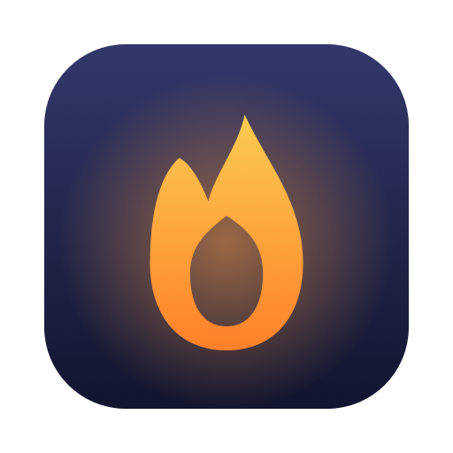

<p align="center">
  
</p>

<h1 align="center">Midnight Oil</h1>

<p align="center">Keep your Mac awake. An open-source, actively maintained replacement for Amphetamine.</p>

<p align="center">
  <a href="https://midnightoil.app">midnightoil.app</a> ·
  <a href="https://github.com/coreyhaines31/midnightoil/releases/latest">Download</a> ·
  <a href="https://github.com/coreyhaines31/midnightoil/issues">Issues</a>
</p>

---

Midnight Oil lives in your menu bar. Click the lamp, pick how long, and your Mac stays awake. It's built for people who liked [Amphetamine](https://apps.apple.com/us/app/amphetamine/id937984704) and want something that's still being worked on.

## Features

- **Sessions** — keep awake indefinitely, for 5 minutes to 12 hours, until a time, while an app is running, or while a file finishes downloading. Extend a running session without restarting it.
- **Closed-lid mode** — keep a MacBook running with the lid shut. A small helper (approved once in System Settings) handles it, and always restores normal sleep when the session ends, the app quits, or anything crashes.
- **Schedules** — stay awake at set times every week, like work hours (Mon–Fri 9–5) or overnight. Skip a window from the menu when you take a day off.
- **Triggers** — start sessions automatically while conditions hold: Wi-Fi network, USB or Bluetooth device, external display, power source, battery level, an app running or in front, IP address, a schedule, or user activity.
- **Drive Alive** — keep external drives from spinning down.
- **Safety rails** — end sessions when unplugged or when the battery drops below a level you choose; an alarm if the lid closes while on battery.
- **Hot keys**, **custom menu bar icons**, **notification sounds**, and **statistics** on how long your Mac's been kept awake.
- **Cmd-drag the icon** to rearrange it in the menu bar. Yes, really.

## Install

**Download** the latest DMG from [Releases](https://github.com/coreyhaines31/midnightoil/releases/latest) and drag Midnight Oil to Applications. The app is signed and notarized, and updates itself.

**Homebrew:**

```sh
brew install --cask coreyhaines31/tap/midnightoil
```

Requires macOS 14 Sonoma or later.

## Building from source

Requires Xcode 16+ and [XcodeGen](https://github.com/yonaskolb/XcodeGen).

```sh
brew install xcodegen swiftlint
xcodegen generate          # creates MidnightOil.xcodeproj from project.yml
open MidnightOil.xcodeproj
```

Or from the command line:

```sh
xcodebuild -project MidnightOil.xcodeproj -scheme MidnightOil test
swiftlint --strict
```

The app's logic (session timing, trigger rules, download detection, statistics) lives in `Packages/MidnightOilCore` with unit tests, so it can be tested without launching the app. `MidnightOilHelper` is the privileged helper for closed-lid mode; it accepts connections only from the signed app.

## How closed-lid mode works

macOS puts a laptop to sleep when the lid closes no matter what apps ask. Midnight Oil ships a tiny helper, registered with `SMAppService`, that runs `pmset disablesleep 1` as root while a closed-lid session runs and `pmset disablesleep 0` the moment it ends. If the app quits or crashes, the helper notices the dropped connection and restores sleep. If the helper itself dies, launchd restarts it and it restores sleep on launch. Nothing is left disabled behind your back.

## Releasing

Push a tag like `v1.2.0` and the [release workflow](.github/workflows/release.yml) builds, notarizes, packages, signs the Sparkle update, and publishes a GitHub release. `Scripts/release.sh` does the same locally. Developer ID signing is cloud-managed, so nothing certificate-shaped lives on any machine.

## License

[MIT](LICENSE) © Corey Haines
